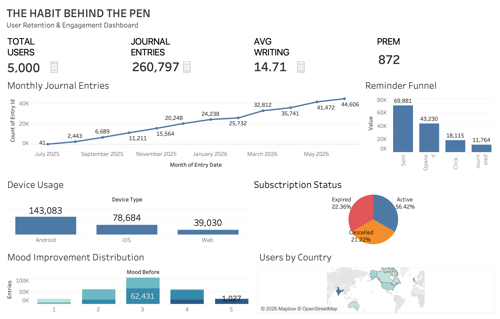

# The Habit Behind the Pen

A product analytics case study exploring user retention and engagement in a fictional digital journaling platform using SQL, Python, and Tableau.

## 📊 Interactive Dashboard

[View the Interactive Tableau Dashboard →](https://public.tableau.com/app/profile/harshata.kotalwar/viz/TheHabitBehindthePen-UserRetentionEngagement/Dashboard1?publish=yes)

## 🖼️ Dashboard Preview

---

## 📌 Project Overview

The Habit Behind the Pen is an end-to-end product analytics case study focused on understanding user engagement and retention in **PenFlow**, a fictional digital journaling platform.

The project follows a complete analytics workflow:

**Business Understanding → Research → Data Generation → Data Validation → SQL Analysis → Python EDA → Tableau Dashboard → Business Recommendations**

The analysis explores how users engage with the platform, how journaling behavior changes over time, how reminders contribute to engagement, and how subscription behavior relates to user activity.
